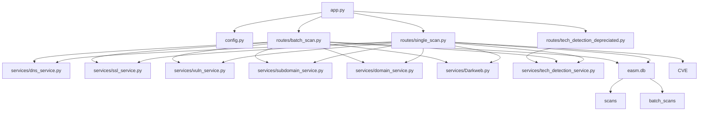

# EASM Project Architectuur

## Architectuur Overzicht (Tekst)

**1. Webapplicatie (Flask)**
- Hoofdbestand: `app.py`
  - Initialiseert de Flask-applicatie.
  - Zet de database op (`easm.db`).
  - Registreert blueprints voor routes.
- Configuratie: `config.py`
  - Bevat API-sleutels, databasepad, en beveiligingsinstellingen.

**2. Routes (Blueprints)**
- `routes/single_scan.py`: Routes voor het scannen van één domein.
- `routes/batch_scan.py`: Routes voor batchscans van meerdere domeinen.

**3. Services**
- `services/`: Bevat logica voor:
  - DNS-scans
  - SSL-informatie
  - Vulnerability scanning
  - Subdomein- en gerelateerde domein-detectie
  - Darkweb/onion link-detectie
  - Technologie-detectie

**4. Templates (Frontend)**
- `templates/index.html`: Hoofdpagina met scanformulier (single/batch).
- `templates/results.html`: Resultaten van een scan.
- `templates/batch_results.html`: Resultaten van batchscans.
- `templates/history.html`: Overzicht van uitgevoerde scans.
- `templates/technology_detection_depreciated.html`: Visualisatie van technologieën.

**5. Database**
- SQLite (`easm.db`)
  - Tabel `scans`: Resultaten van individuele scans.
  - Tabel `batch_scans`: Informatie over batchscans.

**6. Bestanden & Opslag**
- `uploads/`: Geüploade batchbestanden (Batch Scan).
- `results/`: CSV-resultaten van scans.

**7. Overige**
- `Dockerfile` en `compose.yml`: Voor containerisatie.
- `requirements.txt`: Python dependencies.

---

## Mermaid Diagram

---

**Samenvatting:**  
Het project is een modulaire Flask-applicatie voor domeinscans, met een duidelijke scheiding tussen routes, services, templates en opslag. Scans kunnen individueel of in batch worden uitgevoerd, resultaten worden opgeslagen in een SQLite-database en zijn te downloaden als CSV. De frontend gebruikt TailwindCSS en biedt een overzichtelijke gebruikersinterface.
